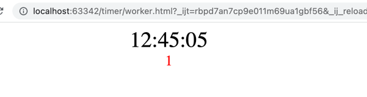
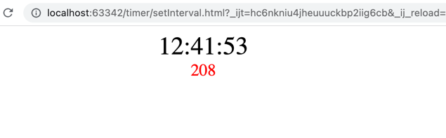

# timer

两种方案，分别对应`setInterval.html`和`worker.html`文件，可以用浏览器打开这两个页面，然后切换到别的页面一段时间，或者最小化浏览器窗口一段时间，观察这两种方案的时间误差。

下面是采用`worker`方案在经过一段时间之后的误差(1秒):

下面是直接使用`setInerval`方案在经过一段时间之后的误差(208秒):

并且通过观察发现`worker`方案的最大误差不超过1秒。
